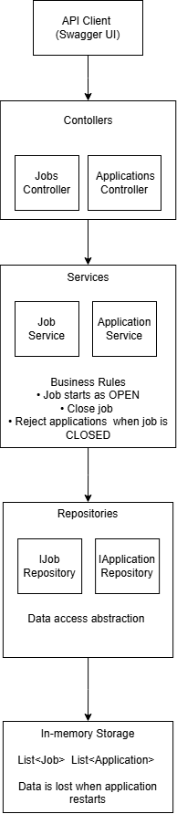

# Job Marketplace API

A backend REST API for a simplified job marketplace. The API allows users to create and retrieve job postings, filter jobs by status, close job postings, submit job applications, and retrieve applications for a specific job.

## Technology Stack

* C#
* ASP.NET Core
* .NET 10
* Swagger / OpenAPI
* xUnit
* In-memory storage

## How to Run

### Prerequisites

* .NET 10 SDK
* Visual Studio Code or Visual Studio

### Run the API

1. Clone the repository.
2. Open the project folder in a terminal.
3. Restore the dependencies:

```bash
dotnet restore
```

4. Run the application:

```bash
dotnet run
```

5. Open Swagger UI using the URL shown in the terminal.

For example:

```text
http://localhost:5114/swagger/index.html
```

> The port may be different depending on the local environment.

### Run Tests

To run the unit tests:

```bash
dotnet test .\Tests\JobApi.Tests\JobApi.Tests.csproj
```

## API Endpoints

### Jobs

| Method | Endpoint               | Description                               |
| ------ | ---------------------- | ----------------------------------------- |
| POST   | `/api/Jobs`            | Create a new job                          |
| GET    | `/api/Jobs`            | Get all jobs, with optional status filter |
| GET    | `/api/Jobs/{id}`       | Get a single job                          |
| POST   | `/api/Jobs/{id}/close` | Close a job posting                       |

### Applications

| Method | Endpoint                         | Description                     |
| ------ | -------------------------------- | ------------------------------- |
| POST   | `/api/jobs/{jobId}/applications` | Submit an application for a job |
| GET    | `/api/jobs/{jobId}/applications` | Get all applications for a job  |

### Job Status

A newly created job is automatically assigned the `OPEN` status.

A job can be explicitly closed using the close endpoint. Once a job is `CLOSED`, new applications are not accepted.

## Architecture

The API follows a layered architecture to separate responsibilities and keep the application easier to maintain and test.



### Layers

* **API Client** — Swagger UI or Postman sends HTTP requests to the API.
* **Controllers** — Handle HTTP requests and return appropriate HTTP responses.
* **Services** — Contain the business logic and application rules.
* **Repositories** — Provide an abstraction for accessing stored data.
* **In-Memory Storage** — Stores jobs and applications using `List<Job>` and `List<Application>`.

### Business Rules

* A newly created job starts with `OPEN` status.
* A job can be explicitly changed to `CLOSED`.
* A `CLOSED` job cannot receive new applications.
* Jobs and applications are stored in memory while the application is running.

The separation between controllers, services, and repositories allows the business logic to be tested independently from the API layer and makes it easier to replace the storage implementation in the future.
